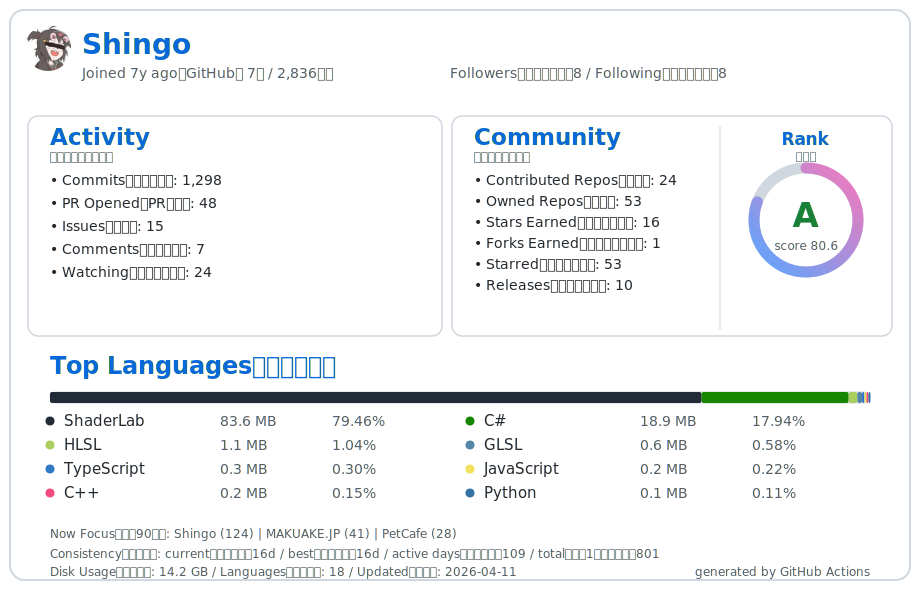

# Hi there 👋 I'm Shingo

Welcome to my GitHub profile!  
ソフトウェア開発者 / Unityエンジニアとして、ゲーム開発、グラフィックスプログラミング、そして効率化ツールの作成に情熱を注いでいます。また、ソフトウェアだけでなくハードウェア（3Dプリンタを活用したモデリング等）を絡めたモノづくりも得意としています。

趣味は**週3回ジム**。増量期間中に、体重は **65kg → 73kg（+8kg）** まで伸ばしました。

> 💡 **Note:** 実際の開発実績や主要なプロジェクトの多くは、業務要件などにより**プライベートリポジトリ**にて管理・運用しています。こちらで公開しているものは、個人開発やオープンソース活動、および参加したプロジェクトの一部となります。

  

---

## 🔭 今やっていること（Now）

新規 **VRChat ワールド**の作成に取り組んでいます。

---

## 🏆 Experience & Awards（経歴・受賞歴）

- **2019.11** 🥈 **第2回 Looking Glass ハッカソン - 準優勝**
- **2019.04** 🏢 **アプリゲーム会社 入社** — 現職（2026年時点で約7年目）
- **2019.03** 🎓 **専門学校 卒業**

---

## 🛠 Skills & Technologies（スキル・使用技術）

### Game Engine & 3D（ゲームエンジン・3Dツール）

### Languages & Scripting（言語・スクリプト）

### Database & Infrastructure（データベース・インフラ）

### Editors & Collaboration（開発ツール・バージョン管理）

---

## 🎯 得意領域（Focus）

実務・個人開発の両方で扱っている、特に強みとしている領域です。

- **Unity エディタ拡張**
- **CI**（GitHub Actions / GitLab CI など）
- **外部 API の設計・作成**
- **Udon**（VRChat）
- **VRChat ワールド制作**（システム・最適化など）
- **自動化**（ツール・ワークフローなど）

---

## 🚀 Projects / Portfolios（開発実績・ポートフォリオ）

公開可能な範囲で、現在メインで取り組んでいる・開発したプロジェクトの一部をご紹介します。

### 🎮 Web Games（ブラウザゲーム）

個人開発し、ブラウザ上で遊べるよう公開しているゲーム作品です。

- 🕹️ **[ジェネリック塊魂](https://unityroom.com/games/generic_katamari)**
  - **概要**: オブジェクトを巻き込んで大きくしていく、塊魂ライクな3Dアクションゲーム
  - `Unity` `C#` `WebGL`

### 🌍 VRChat Worlds（システム開発 / ワールド制作）

私がバックエンドのシステム開発（Udon / C#）や、空間デザイン・モデリングなどを担当したVRChatワールドです。
_(※一部の非公開プロジェクトやワールドでは、VRChatから外部Webサーバー・APIへの連携システムの構築なども担当しています)_

- 🌌 **[ツーショットマッチング制 恋のMAKUAKE](https://vrchat.com/home/world/wrld_17905f5b-a310-48cc-b7ca-c03b0a1e5067/info)**
  - **概要**: 自動マッチングシステム、およびワールドの部屋の軽量化（最適化）システム
  - `Unity` `UdonSharp` `C#`

- 🎡 **[居心地ポイント制 MAKUAKE JP](https://vrchat.com/home/world/wrld_355a0278-aaff-4ee0-ba20-e6912386f898/info)**
  - **概要**: プレイヤー間のポイント送信システム、およびポイント自動保存・加算システム
  - `Unity` `UdonSharp` `C#`

- 🔑 **[ワールドログインシステム](https://vrchat.com/home/world/wrld_45020b1b-5820-4642-8f42-b726e4a5fde6/info)**
  - **概要**: 外部サーバーを経由したワールドログインシステムの構築・実装
  - `Unity` `UdonSharp` `C#` `API`

- 🌙 **[Melty Night](https://x.com/VRC_MeltyNight)**
  - **概要**: アセットの配置や、Blenderを用いた再編集・拡張によるワールド空間の制作
  - `Unity` `Blender`

### 💻 GitHub Projects / Tools（オープンソースツール / ボット開発）

個人開発や、業務効率化のために作成したツール群、およびAPIを活用したボット開発の実績です。

- 🎙️ **[dji-mic-secretary](https://github.com/KatanoShingo/dji-mic-secretary)**
  - **概要**: DJI Mic 2を利用した自動文字起こし、自動保存、自動抽出を行う業務効率化ツール
  - `Python` `API`

- 🔄 **[AutoBackup](https://github.com/KatanoShingo/AutoBackup)**
  - **概要**: 作業中のデータ消失を防ぐ、UnityのSceneデータを自動バックアップする拡張ツール
  - `Unity` `C#`

- ⌨️ **[KeyhacKeymap](https://github.com/KatanoShingo/KeyhacKeymap)**
  - **概要**: キーボード操作を最適化し、日々の作業を効率化するためのKeyhac用カスタムキーマップ設定
  - `Python`

- 🤖 **Twitter(X) / Discord / Slack Bot 開発**
  - **概要**: 各種APIを活用し、自動投稿やサーバー・ワークスペース内の便利機能を提供するボットシステムの開発実績
  - `Python` `TypeScript` `GAS` `Cloudflare Workers`

### 🛍️ BOOTH Assets（公開中の販売アイテム）

BOOTHにて公開・販売している、Unity開発者向けの便利ツール群です。

- 📦 **[FileSplitMergeTool](https://feitas.booth.pm/items/6990234)**
  - **概要**: 大容量のUnityファイルを分割・結合し、容量制限の回避やクラッシュ対策に役立つツール
  - `Unity` `C#`

- 📦 **[OBJExporter](https://feitas.booth.pm/items/7005523)**
  - **概要**: 複数の3Dオブジェクトや再生中のアニメーションを、ワンクリックで出力できる3Dプリント・加工支援ツール
  - `Unity` `C#` `3D Print`

- 📦 **[UpdateChecker](https://feitas.booth.pm/items/7008337)**
  - **概要**: アセット商品ページの更新をUnityエディタ上で一括管理・検知できる開発者向けチェッカー
  - `Unity` `C#`

> _(※ その他、公開可能なリポジトリ一覧は [Repositories](https://github.com/KatanoShingo?tab=repositories) タブからご覧ください)_

---

## 📫 Contact（お問い合わせ）

転職については<strong>正社員（フルタイム）</strong>での就業を希望しており、<strong>副業</strong>についてもご相談可能です。勤務形態のご希望としては、出社を伴う場合は<strong>関東圏</strong>、リモート勤務の場合は<strong>地域の限定はありません</strong>。お仕事のご依頼や内容のご相談は、下記メールアドレスよりお願いいたします。

- ✉️ **Email**: [work@shingo.info](mailto:work@shingo.info)

日常のつぶやきや個人の活動については、X (Twitter) アカウントをご覧ください。

- 🐦 **X (Twitter)**: [@shi_k_7](https://x.com/shi_k_7)
