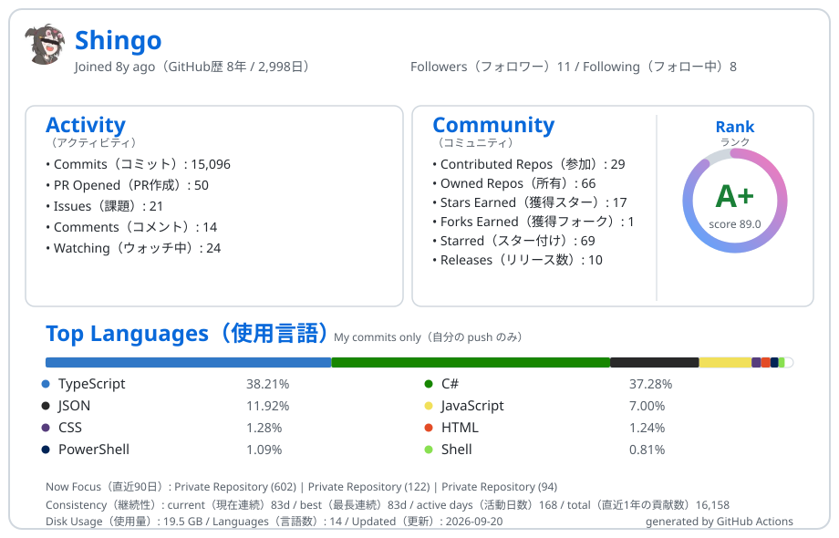

# Hi there 👋 I'm Shingo

Welcome to my GitHub profile!  
ソフトウェア開発者 / Unityエンジニアとして、ゲーム開発、グラフィックスプログラミング、そして効率化ツールの作成に情熱を注いでいます。また、ソフトウェアだけでなくハードウェア（3Dプリンタを活用したモデリング等）を絡めたモノづくりも得意としています。

趣味は**週3回ジム**。増量期間中に、体重は **65kg → 73kg（+8kg）** まで伸ばしました。

> 💡 **Note:** 実際の開発実績や主要なプロジェクトの多くは、業務要件などにより**プライベートリポジトリ**にて管理・運用しています。こちらで公開しているものは、個人開発やオープンソース活動、および参加したプロジェクトの一部となります。

  

---

## 👤 できること（ひとことで）

- **ゲーム開発** — Unity を使ったゲーム制作・公開
- **VRChat** — ワールドの仕組みづくり・空間制作・外部サービス連携
- **Webサービス** — ブラウザで使えるサイト・アプリの企画〜実装
- **効率化ツール** — 手作業を減らす自動化・開発支援ツールの作成

---

## 🔭 今やっていること（Now）

新規 **VRChat ワールド**の作成に取り組んでいます。

---

## 🏆 経歴・受賞歴

- **2019.11** 🥈 **第2回 Looking Glass ハッカソン - 準優勝**
- **2019.04** 🏢 **アプリゲーム会社 入社** — 現職（2026年時点で約7年目）
- **2019.03** 🎓 **専門学校 卒業**

---

## 🛠 スキル・使用技術

### ゲームエンジン・3Dツール

### 言語・スクリプト

### データベース・インフラ

### 開発ツール・バージョン管理

---

## 🎯 得意領域

特に強みとしている領域です。

- **Unity の作業を効率化するツール作り**
- **繰り返し作業の自動化**（CI・ワークフローなど）
- **外部サービスとのつなぎ込み**（API 設計・実装）
- **VRChat ワールドの仕組みづくり**（マッチング、ポイント、ログインなど）
- **VRChat ワールド制作**（システムの軽量化・最適化を含む）

---

## 🚀 ポートフォリオ（開発実績）

公開できる範囲で、作ったもの・関わったものを紹介します。  
リンクから実際に触れるものもあります。

### 🎮 遊べる作品

ブラウザで遊べるゲームです。

- 🕹️ **[巻き込みソウル](https://unityroom.com/games/generic_katamari)**
  - **なにができる**: オブジェクトを巻き込んで大きくしていく、3Dアクションゲーム
  - **担当**: 企画〜開発〜公開まで一通り

### 🎓 学生時代の作品

専門学校在学中に制作したポートフォリオ作品です。プロジェクトデータは紛失しており、当時のプレイ動画のみ残っています。

- 🥊 **[ミズターファイト](https://x.com/shi_k_7/status/1021315186248912898)**（2018）
  - **なにができる**: Unity 製のポートフォリオゲーム（学生時代）
  - **担当**: 企画〜開発
  - **残っているもの**: [プレイ動画（X）](https://x.com/shi_k_7/status/1021315186248912898)

### 🌐 使えるWebサービス

ブラウザから使えるサイト・アプリです。

- 🛒 **BOOTH検索広場** — [サイトを見る](https://review.makuake.org/web/) ／ [VRChatワールドを見る](https://vrchat.com/home/world/wrld_faeb99cb-3f2b-4a01-9819-c95500833709/info)
  - **なにができる**: BOOTH商品の検索・レビュー投稿・週間ランキング。WebとVRChatでレビューデータを共有
  - **担当**: Web側の開発、およびワールド内のレビュー投稿・閲覧の仕組みづくり

- 📇 **[VRC名鑑](https://vrc-meikan.makuake.org)**
  - **なにができる**: VRChatユーザー向けのアバター作品＆プレイスタイル公開名鑑。スワイプ閲覧・保存・公開プロフィールなど
  - **担当**: 企画〜開発〜公開まで一通り

### 🌍 VRChat ワールド

仕組みづくり（マッチング・ポイント・ログインなど）や、空間デザインを担当したワールドです。  
※一部では、VRChatと外部Web・サーバーをつなぐ連携も担当しています。

- 🌌 **[ツーショットマッチング制 恋のMAKUAKE](https://vrchat.com/home/world/wrld_17905f5b-a310-48cc-b7ca-c03b0a1e5067/info)**
  - **なにができる**: 自動で相手とマッチングする仕組み。部屋を軽く保つ最適化も含む
  - **担当**: マッチングシステム、および軽量化（最適化）

- 🎡 **[居心地ポイント制 MAKUAKE JP](https://vrchat.com/home/world/wrld_355a0278-aaff-4ee0-ba20-e6912386f898/info)**
  - **なにができる**: プレイヤー同士でポイントを送り合い、自動で保存・加算される仕組み
  - **担当**: ポイント送信・保存・加算システム

- 🔑 **[ワールドログインシステム](https://vrchat.com/home/world/wrld_45020b1b-5820-4642-8f42-b726e4a5fde6/info)**
  - **なにができる**: 外部サーバーと連携した、ワールドへのログイン仕組み
  - **担当**: ログインシステム全体の構築・実装

- 🌙 **[Melty Night](https://x.com/VRC_MeltyNight)**
  - **なにができる**: 夜の雰囲気のワールド空間
  - **担当**: アセット配置、Blenderでの再編集・拡張による空間制作

- 📛 **[テキストファンタジア - 日本語話者向け集会場 -](https://vrchat.com/home/world/wrld_e32f8deb-7ffc-4e28-820d-8b249d8d326c/info)**
  - **なにができる**: 超軽量な、ワールド内ネームプレートガチャ
  - **担当**: ガチャの仕組みづくり

### 🛠 効率化・開発支援

手作業を減らすツールや、開発者向けの販売アイテムです。

- 🎙️ **[dji-mic-secretary](https://github.com/KatanoShingo/dji-mic-secretary)**
  - **なにができる**: DJI Mic 2の音声を、自動で文字起こし・保存・抽出する業務効率化ツール
  - **担当**: 企画〜開発

- 🔄 **[AutoBackup](https://github.com/KatanoShingo/AutoBackup)**
  - **なにができる**: Unityの作業中データを自動バックアップし、消失を防ぐツール
  - **担当**: 企画〜開発

- ⌨️ **[KeyhacKeymap](https://github.com/KatanoShingo/KeyhacKeymap)**
  - **なにができる**: キーボード操作を短く・速くするためのカスタム設定
  - **担当**: 企画〜開発

- 🤖 **Bot 開発**
  - **なにができる**: X（Twitter）／Discord／Slack向けボット、メルカリ新着の監視・通知など
  - **担当**: 各種ボットの設計・実装

- 📦 **[FileSplitMergeTool](https://feitas.booth.pm/items/6990234)**（BOOTH販売）
  - **なにができる**: 大きなUnityファイルを分割・結合し、容量制限やクラッシュ対策に使うツール
  - **担当**: 企画〜開発〜販売

- 📦 **[OBJExporter](https://feitas.booth.pm/items/7005523)**（BOOTH販売）
  - **なにができる**: 3Dオブジェクトやアニメーションを、ワンクリックで書き出す加工支援ツール
  - **担当**: 企画〜開発〜販売

- 📦 **[UpdateChecker](https://feitas.booth.pm/items/7008337)**（BOOTH販売）
  - **なにができる**: アセット商品ページの更新を、Unity上でまとめて確認できるツール
  - **担当**: 企画〜開発〜販売

> その他の公開リポジトリは [Repositories](https://github.com/KatanoShingo?tab=repositories) からご覧ください。

---

## 🤝 オープンソースへの貢献

他の人が主導するプロジェクトに、コードや改善で参加した事例です。

- 🧩 **[agent-skills-vrc-udon](https://github.com/niaka3dayo/agent-skills-vrc-udon)**
  - **なにができる**: VRChat向け開発をAIエージェントが支援するためのスキル定義・ルールなど
  - **担当**: コントリビュート（定義・ルール・検証まわり）

- 🤖 **[PremaindAI_TechVerification](https://github.com/neon-izm/PremaindAI_TechVerification)**
  - **なにができる**: プリメイドAIのダンスモーションを解析・Unityで検証するプロジェクト
  - **担当**: コントリビュート（可動域の修正、軽微なバグ修正など）

---

## 🎁 おまけ：Gitの「ドットファイル」完全チートシート

Git周りの紛らわしいファイルやフォルダを整理しました。開発の小ネタにお役立てください！

- **【公式】基本設定**： **`.gitignore`** (無視指定) ｜ **`.gitattributes`** (属性定義) ｜ **`.gitconfig`** (Git本体設定)
- **【公式】応用・詳細**： **`.gitmodules`** (サブモジュール) ｜ **`.git-blame-ignore-revs`** (整形履歴無視) ｜ **`.mailmap`** (名寄せ) ｜ **`.git/info/exclude`** (自分専用の無視設定)
- **【自動化・拡張】**： **`.gitlab-ci.yml`** (GitLab CI) ｜ **`.github/`** (GitHub Actions等) ｜ **`.githooks/`** (特定操作で発動するスクリプト) ｜ **`.lfsconfig`** (LFSの特殊設定)
- **【慣習・ダミー】**： **`.gitkeep`** (空フォルダ維持) ｜ **`.gitmessage`** (コミットメッセージ雛形)
- **⚠️ Gitの心臓部**： **`.git/`** (全履歴フォルダ) ｜ **`.git`** (サブモジュール等では心臓部へのパスが書かれた「ファイル」に変化)

---

## 📫 お問い合わせ

転職については<strong>正社員（フルタイム）</strong>での就業を希望しており、<strong>副業</strong>についてもご相談可能です。勤務形態のご希望としては、出社を伴う場合は<strong>関東圏</strong>、リモート勤務の場合は<strong>地域の限定はありません</strong>。お仕事のご依頼や内容のご相談は、下記メールアドレスよりお願いいたします。

- ✉️ **Email**: [work@shingo.info](mailto:work@shingo.info)

日常のつぶやきや個人の活動については、X (Twitter) アカウントをご覧ください。

- 🐦 **X (Twitter)**: [@shi_k_7](https://x.com/shi_k_7)
